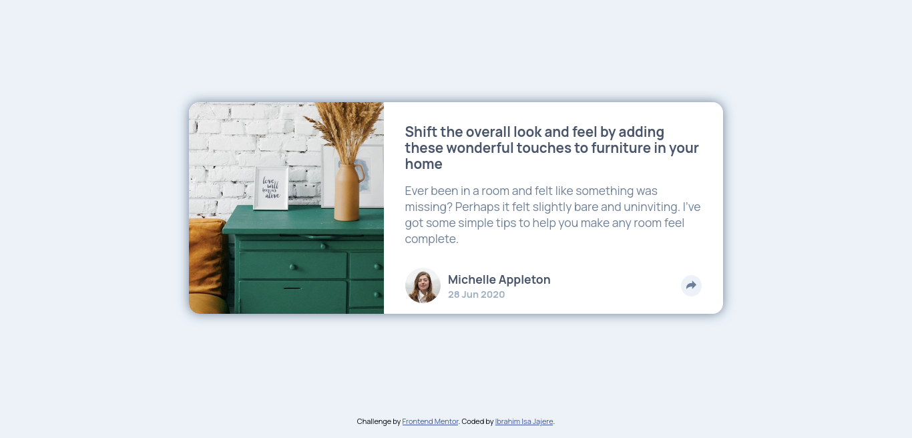
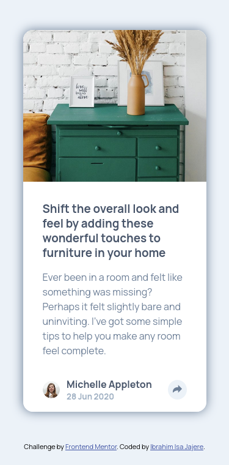

# Frontend Mentor - Article preview component solution

This is a solution to the [Article preview component challenge on Frontend Mentor](https://www.frontendmentor.io/challenges/article-preview-component-dYBN_pYFT).

## Table of contents

- [Overview](#overview)
  - [The challenge](#the-challenge)
  - [Screenshot](#screenshot)
  - [Links](#links)
- [My process](#my-process)
  - [Built with](#built-with)
  - [What I learned](#what-i-learned)
  - [Continued development](#continued-development)
- [Author](#author)

## Overview

### The challenge

Users should be able to:

- View the optimal layout for the component depending on their device's screen size
- See the social media share links when they click the share icon

### Screenshot

**Desktop**


**Mobile**


### Links

- Solution URL: [Frontend mentor](https://your-solution-url.com)
- Live Site URL: [https://festive-torvalds-2df4d5.netlify.app/](https://festive-torvalds-2df4d5.netlify.app/)

## My process

### Built with

- Semantic HTML5 markup
- SCSS properties
- Flexbox
- CSS Grid
- Mobile-first workflow

### What I learned

```js
  matchMedia("(min-width: 800px)").matches
```
returns `true` if the media query matches

```js
  domElement.contains(anotherDomElement)
```
returns `true` if `anotherDomElement` is a child of `domElement` or is the `domElement` itself.

### Continued development

This solution is currently not accessible but i will try to practice accessibility in my future projects.

## Author

- Frontend Mentor - [@ibrahimisa](https://www.frontendmentor.io/profile/ibrahimisa)
- Twitter - [@ibrahim_isa274](https://www.twitter.com/ibrahim_isa274)